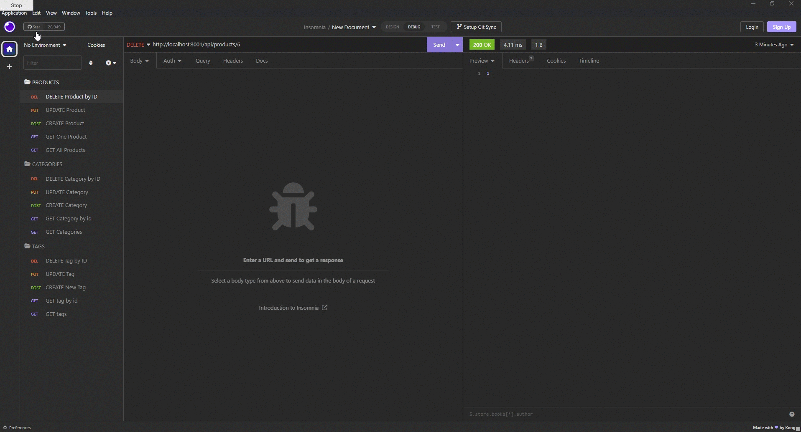

# E-commerce-Back-End

[](https://opensource.org/licenses/MIT)

## Table of Contents
* [Description](#description)
* [Installation](#installation)
* [Screenshot](#screenshot)
* [Video](#video)
* [Usage](#usage)
* [Licenses](#license)
* [Questions](#questions)
* [Credits](#credits)

## Description
This is an back end application for a e-commerce clothing website. The application uses express.js API and Sequelize that interacts with MYSQL database. Database is created using mySQL and models associated with the database. API routes are use to perform RESTful CRUD operations.

## Installation
- This app requires Node.js, Express.js, and Sequelize run ```npm install``` for dependencies. 
- In order to connect to the database the user must run ```mysql -u root -p``` in the terminal and enter their password. 
- In mysql, source schema.sql.
- Next seed the files ```node seeds/index.js```.
- Finally run ```nodemon server.js``` to start the server!

## Screenshot


## Video


## Usage
This app allows the user to view, add, edit, and delete categories, products, and tags.

## Licenses
This project is covered under the MIT license. click the license button at the top to learn more.

https://opensource.org/licenses/MIT

## Questions
Questions regarding this project?
GitHub: https://github.com/Ryebread5555
Email: rypetty55@gmail.com

## Credits
- JavaScript
- NodeJS
- Express.js
- Sequelize
- MySql
- Insomnia

